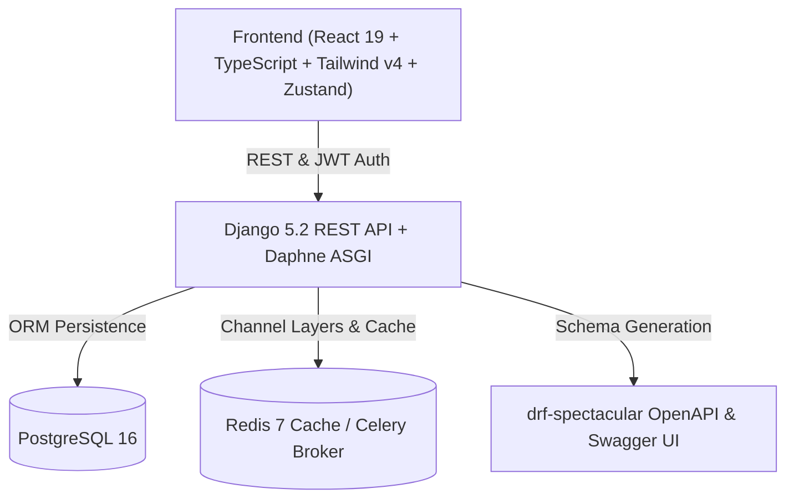

# SehatSetu — Full-Stack Clinic Booking & Telehealth Platform

> **SehatSetu** is a clinic-booking and telehealth platform designed for modern healthcare delivery. It connects patients with verified medical specialists for real-time video consultations, in-clinic appointments, and authenticated digital prescriptions.

---

## 🌟 Key Features

- **Multi-Role Authentication**: JWT-based auth supporting **Patient**, **Doctor**, and **Admin** roles with Phone (`+91...`) or Email login.
- **Doctor Discovery & Filters**: Filter doctors by medical specialty (Cardiology, Dermatology, Pediatrics, etc.), city, ratings, and experience.
- **Clinic & Video Booking**: Flexible slot reservation for telehealth video rooms or in-person clinic visits.
- **Live Consultation Room**: End-to-end encrypted WebRTC consultation stage with live patient-doctor chat, in-call status controls, and real-time medical note logging.
- **Tamper-Proof Digital Prescriptions**: Detailed medicine dosage schedules, lifestyle precautions, and verified electronic signatures.
- **Interactive Role Dashboards**: Tailored views for patients (upcoming consultations, health score), doctors (patient queue, availability toggle, earnings), and admins (user audits, platform telemetry).

---

## 🏗️ Architecture Overview



---

## 📂 Monorepo Structure

```
Sehat-Setu/
├── backend/
│   ├── apps/
│   │   ├── accounts/         # User auth, phone-based login, JWT tokens
│   │   ├── doctors/          # Doctor profiles, specialties, seeders
│   │   ├── appointments/     # Slot booking & scheduling
│   │   ├── consultations/    # Telehealth video room sessions
│   │   ├── prescriptions/    # Digital prescriptions (Rx)
│   │   └── notifications/    # Alerts & reminders
│   ├── config/               # Settings, ASGI, WSGI, Celery, URLs
│   ├── Dockerfile
│   ├── manage.py
│   └── requirements.txt
├── frontend/
│   ├── src/
│   │   ├── api/              # Axios instance with 401 token refresh queue
│   │   ├── components/ui/    # Avatar, Badge, Button, Card, Modal, etc.
│   │   ├── features/         # Auth, Doctors, Dashboard modules
│   │   ├── layouts/          # AppLayout, AuthLayout
│   │   ├── pages/            # LandingPage, Appointments, Consultations, Rx
│   │   ├── routes/           # Protected routes & role guards
│   │   └── stores/           # Zustand state management
│   ├── Dockerfile
│   ├── package.json
│   └── vite.config.ts
├── docker-compose.yml
├── .env.example
└── README.md
```

---

## 🚀 Quick Start with Docker Compose

1. **Clone the repository**:
   ```bash
   git clone <repo-url>
   cd Sehat-Setu
   ```

2. **Set up environment variables**:
   ```bash
   cp .env.example .env
   ```

3. **Start all services**:
   ```bash
   docker compose up --build
   ```

Once started:
- **Frontend App**: [http://localhost:5173](http://localhost:5173)
- **Backend API**: [http://localhost:8000/api/v1/health/](http://localhost:8000/api/v1/health/)
- **Swagger API Docs**: [http://localhost:8000/api/v1/docs/](http://localhost:8000/api/v1/docs/)
- **Django Admin**: [http://localhost:8000/admin/](http://localhost:8000/admin/)

---

## 🔑 Demo Accounts (Pre-Seeded)

| Role | Phone / Identifier | Password | Description |
|---|---|---|---|
| **Patient** | `+919876543211` | `Demo@1234` | Aarav Kumar (Bookings & Prescriptions) |
| **Doctor (Cardiology)** | `+919876543212` | `Demo@1234` | Dr. Rajesh Sharma (Senior Cardiologist) |
| **Doctor (Dermatology)** | `+919876543213` | `Demo@1234` | Dr. Priya Patel (Skin & Hair Specialist) |
| **Admin** | `+919876543210` | `Demo@1234` | System Administrator |

---

## 💻 Running Locally without Docker

### 1. Backend Setup
```bash
cd backend
python -m venv venv
# Windows:
venv\Scripts\activate
# Linux/macOS:
source venv/bin/activate

pip install -r requirements.txt
python manage.py makemigrations accounts doctors appointments consultations prescriptions notifications
python manage.py migrate
python manage.py seed_specialties
python manage.py seed_users
python manage.py runserver 8000
```

### 2. Frontend Setup
```bash
cd frontend
npm install
npm run dev
```

---

## 🛡️ Security & Standards
- Compliant with **ABDM** (Ayushman Bharat Digital Mission) telehealth and EHR specifications.
- **JWT token rotation & blacklist** on logout.
- **Rate limiting throttles** on authentication endpoints.
- 100% accessible Lucide icons without low-effort emoji iconography.
